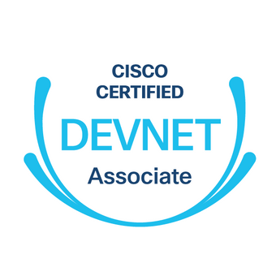

# Cisco DevNet Associate Data Encoding Formats Hands-On Lab Guide

## Overview

When we automate to IT systems, we get the fantastic benefit of _not_ having to either copy and paste configuration changes to dozens (maybe hundreds) of different systems or repeat the same click, click, click, click, click-through-the-UI marathon over, and over, and over..._every single time_ there's a need to make a bulk change :rage:.  To automate these sorts of workflows, it's important that we learn to write some form of automation-specific code.  To make that possible, it's essential that we know how to read and write the **data structures** that our code sends to and receives from the systems we automate.

This guide will walk you through some hands-on exercises which help teach and and also give you a place to practice using various **data encoding formats** with Python.  You'll get the most from these exercises if you have at least a little bit of exposure to Python fundamentals although we put the step-by-step directions together in a way that welcomes all experience levels.

---

## Usage

Navigate to [https://wwt.github.io/devasc-data-formats](https://wwt.github.io/devasc-data-formats) and follow the guided walkthrough instructions.
