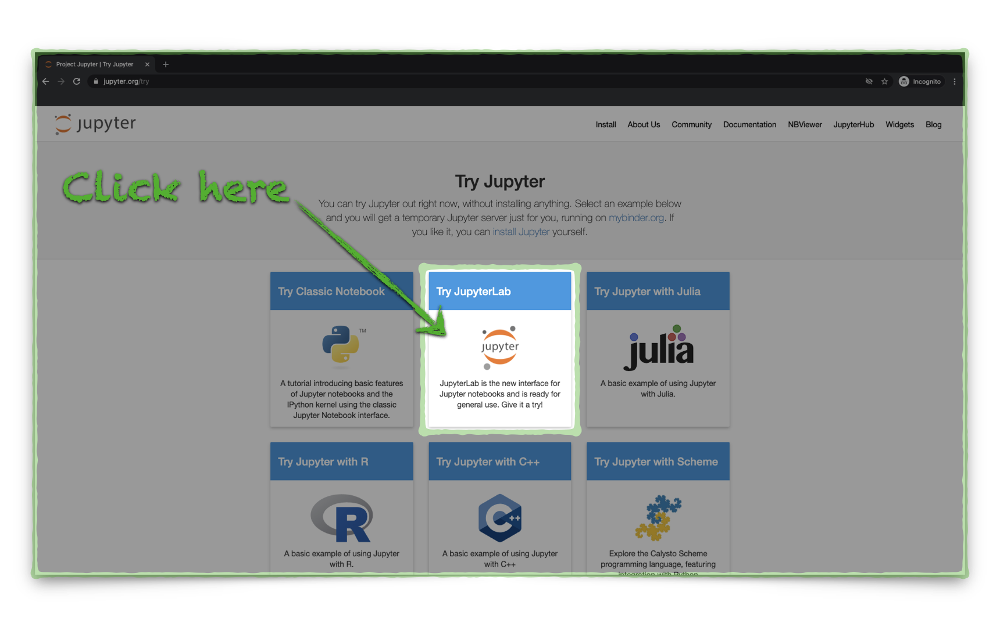
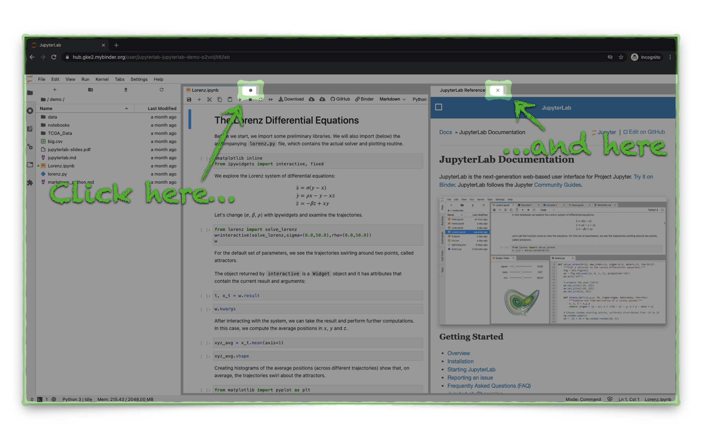
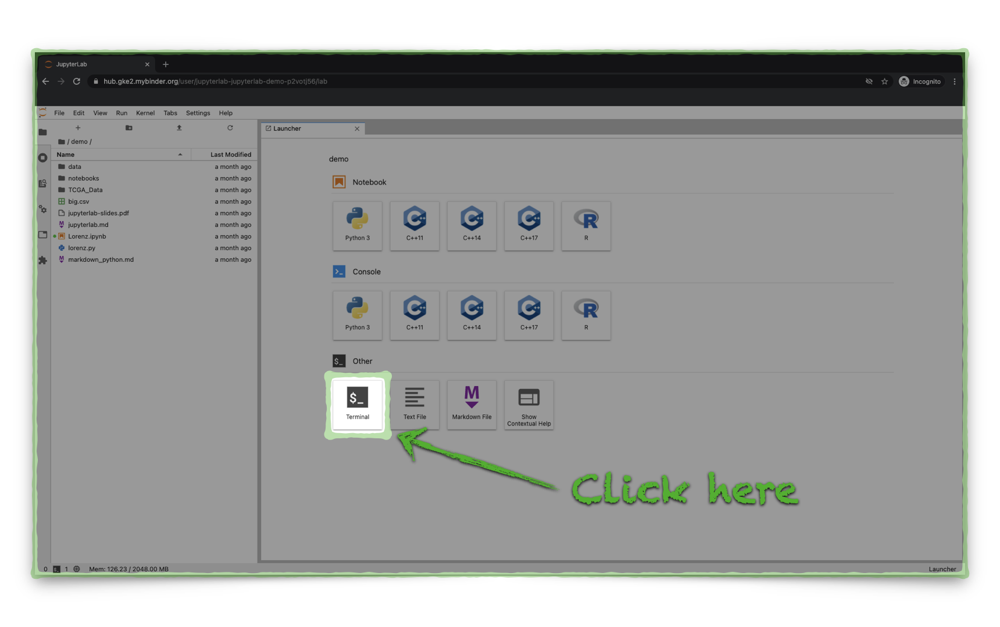
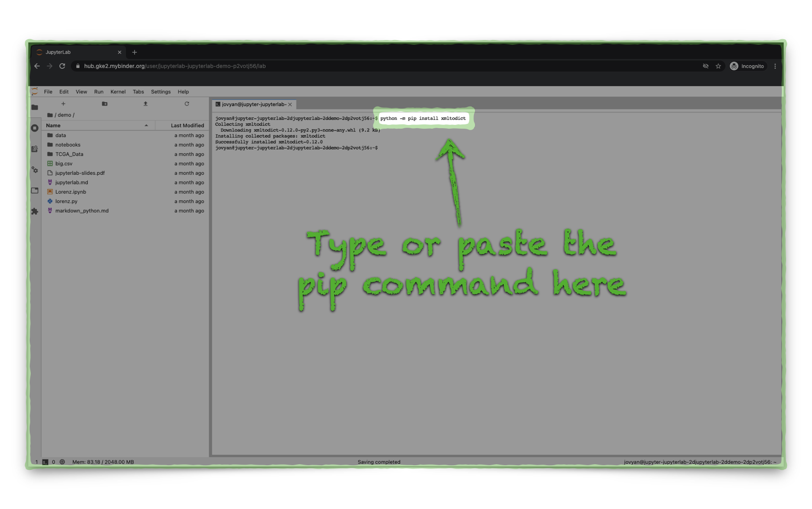
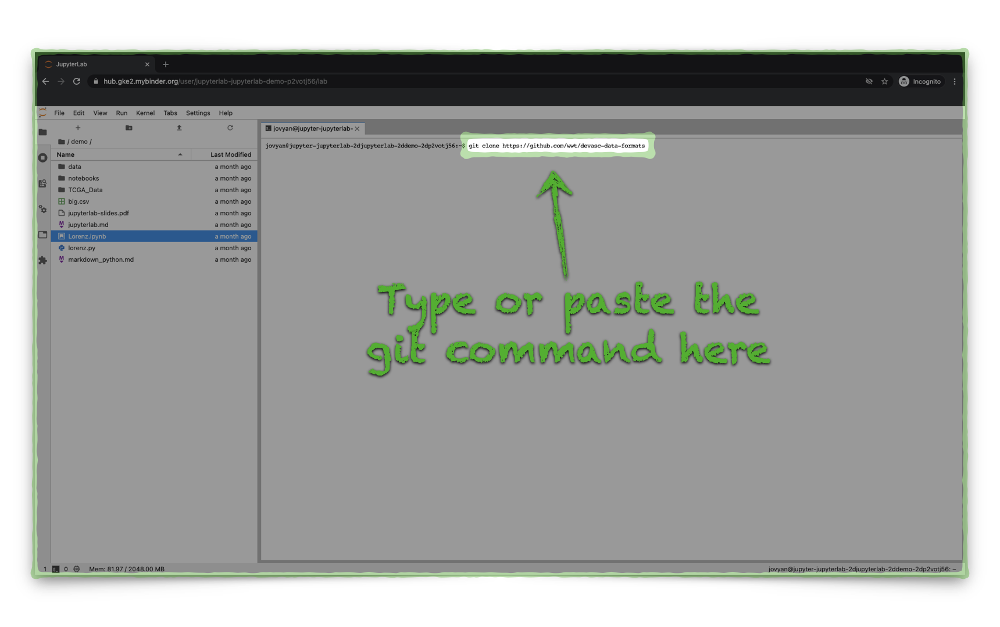
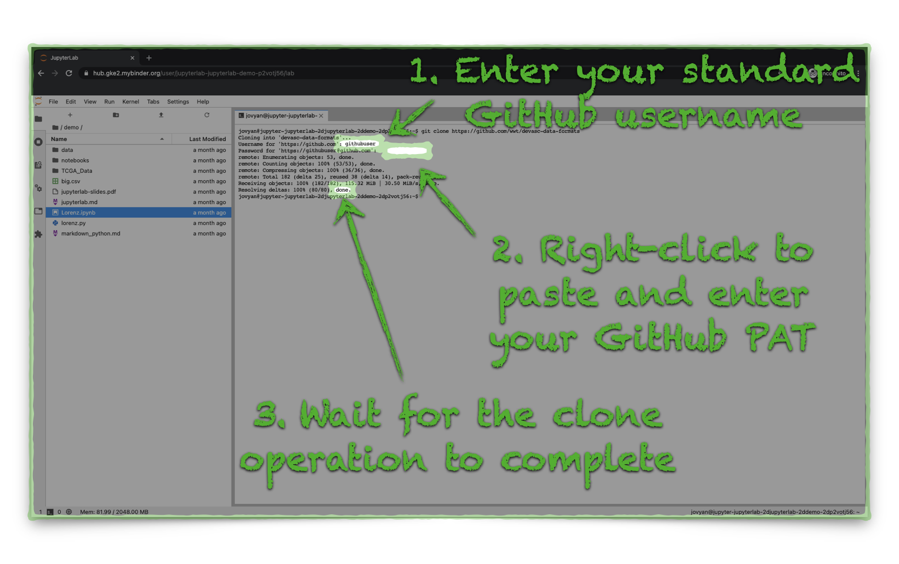
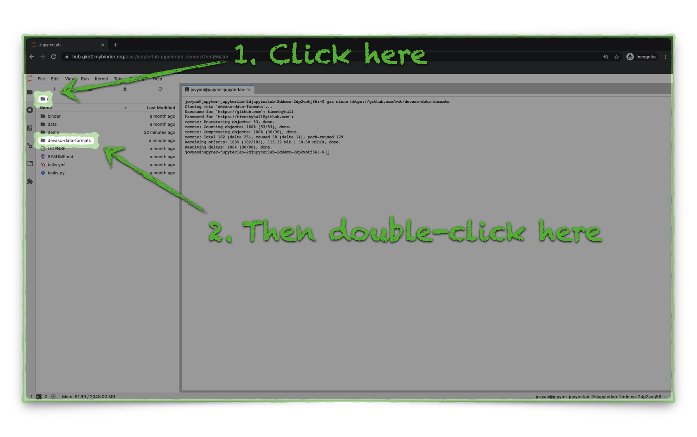
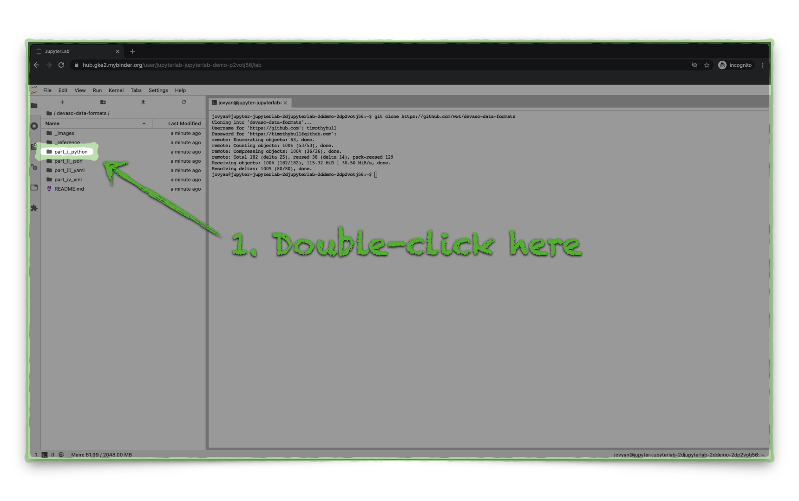
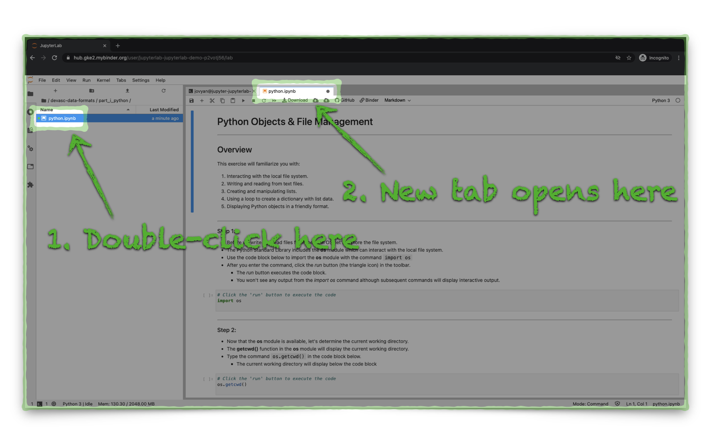

# DEVASC Data Encoding Formats Hands-On

## Overview

This repo has several guided, hands-on exercises which will help you learn and practice how to use various data encoding formats with Python.  These exercises compliment the *Data Encoding Formats* presentation which is available in the Study Group files repository.

The **Lab Setup** section has step-by-step directions to help you deploy the learning materials using a guided, interactive Python tool called [JupyterLab](https://jupyterlab.readthedocs.io/en/stable/getting_started/overview.html).

\*\* Note - this lab requires that you have a **GitHub *Personal Access Token (PAT)*** available with ***repo*** scope permissions \*\*

* You will authenticate to GitHub using your standard GitHub username and substitute your PAT for your password.
* Directions to setup a PAT are here -  [GitHub Personal Access Token Setup](https://docs.github.com/en/enterprise/2.15/user/articles/creating-a-personal-access-token-for-the-command-line).
* If you are a WWT employee, be sure to **enable SSO** for your PAT.


*GitHub PAT SSO Setup*:


---


## Lab Setup

### Jupyter Lab Environment

1. Open the [Jupyter In-Browser Trial Site](https://jupyter.org/try) landing page and click the **Try JupyterLab** button:
   - It may take several seconds for the JupyterLab trial to load, please be patient.




---


2. The JupyterLab trial site will automatically open some tabbed panes, close all JupyterLab panes:

   - Click the upper-right corner in each of the open JupyterLab trial panes.
   - Click the  button if you receive a prompt to save changes.
   - A new **Launcher** tab will appear, leave this pane open.




---


3. Click the **Terminal** button in the **Other** section of the **Launcher** tab to open a new terminal window:

   - A new tab will open with a Linux terminal shell.




---


### JupyterLab Environment Configuration

1. Install the **xmltodict** Python Package with the following command in the JupyterLab terminal:
   - Choose one of the two optional commands below to perform the installation with **pip**.
   - For this and subsequent commands/input, you may type in the JupyterLab terminal directly or you may paste content in the JupyterLab terminal with a keyboard paste sequence:
     - Windows - Ctrl-V
     - macOS - Command-V

```shell
# Option 1 - direct package install
python -m pip install xmltodict

# Option 2 - install via requirements file
python -m pip install -r devasc-data-formats/requirements.txt
```




2. Clone the Git repository to the JupyterLab environment with the following command in the JupyterLab terminal:

```shell
git clone https://github.com/wwt/devasc-data-formats
```



3. When prompted, enter your GitHub credentials:
   - Use your standard GitHub username.
   - Substitute your PAT for your password.




4. Click on the root folder icon in the file navigator and then double-click on the **devasc-data-formats** folder:




5. Double-click on the **part_i_python** folder:




6. Start the exercises in the Jupyter Notebooks:
   - Click on the **python.ipynb** Notebook to open a new tab.


   


7. Follow the step-by-step instructions in the Jupyter Notebook
   - Follow the navigation at the bottom of each Notebook to advance to other exercises.
   - Continue to use the file navigator, as necessary, to access different notebooks and repository files.


## Navigation

---
#### Navigation
* **Home**
* [Exercise 1 - Python Objects & File Management](part_i_python/python.ipynb)
* [Exercise 2 - JSON Structured Data](part_ii_json/json.ipynb)
* [Exercise 3 - YAML Structured Data](part_iii_yaml/yaml.ipynb)
* [Exercise 4 - XML Structured Data](part_iv_xml/xml.ipynb)


