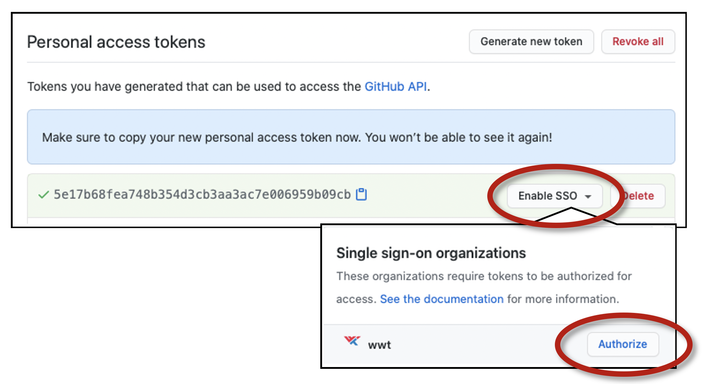
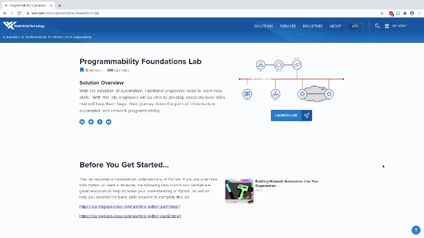
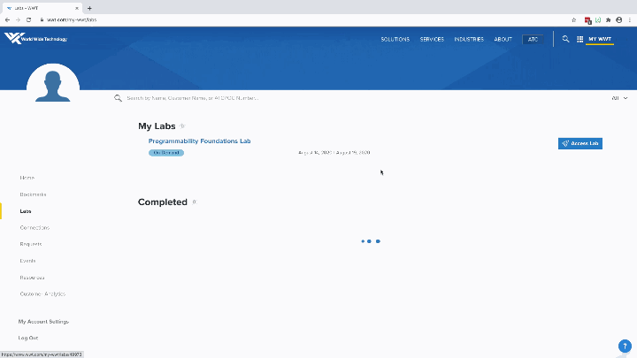

# DEVASC Data Encoding Formats Hands-On

## Overview

This repo has several guided, hands-on exercises which will help you learn and practice how to use various data encoding formats with Python.  These exercises compliment the *Data Encoding Formats* presentation which is available in the Study Group files repository.

The **Lab Setup** section has step-by-step directions to help you deploy the learning materials using [JupyterLab](https://jupyterlab.readthedocs.io/en/stable/getting_started/overview.html) within the [WWT Programmability Foundations Lab](https://www.wwt.com/lab/programmability-foundations-lab).

\*\* Note - this lab requires that you have a **GitHub *Personal Access Token (PAT)*** available with ***repo*** scope permissions \*\*

* You will authenticate to GitHub using your standard GitHub username and substitute your PAT for your password.
* Directions to setup a PAT are here -  [GitHub Personal Access Token Setup](https://docs.github.com/en/enterprise/2.15/user/articles/creating-a-personal-access-token-for-the-command-line).
* If you are a WWT employee, be sure to **enable SSO** for your PAT.

*GitHub PAT SSO Setup*:

---

## Lab Setup

### Programmability Foundations Lab Launch

1. Access the [WWT Programmability Foundations Lab](https://www.wwt.com/lab/programmability-foundations-lab) landing page and click the **Launch Lab** button:

---

2. Click the **My WWT** link and click the **My Labs** button on the next page:

---

3. Click the **Access Lab** button next to your *Programmability Foundations Lab* abd click the **Open in ATC Lab Gateway** button:

- It may take a few minutes for Windows services to start, please be patient.

---

4. Click **Skip This Build** on the *Docker Desktop Update* window and click **Dismiss** on the *Docker Feedback* window.

---

5. Expand the Windows 10 System Tray and wait for *Docker Desktop* to start.

- A system notification will display when Docker Desktop starts; this may take several minutes.

---

### JupyterLab Launch

1. Download configuration file and installation script:
2. Grant Windows PowerShell permission to run unsigned scripts:
3. Run the JupyterLab Launcher script:
4. Access the exercises using Jupyter Notebooks

## Navigation

---
#### Navigation
* **Home**
* [Exercise 1 - Python Objects & File Management](part_i_python/python.ipynb)
* [Exercise 2 - JSON Structured Data](part_ii_json/json.ipynb)
* [Exercise 3 - YAML Structured Data](part_iii_yaml/yaml.ipynb)
* [Exercise 4 - XML Structured Data](part_iv_xml/xml.ipynb)

