# Getting Started With The Lab

## :fontawesome-solid-flask: Lab Overview

The lab environment runs in a Docker Container which hosts a web-based, interactive Python environment called [JupyterLab](https://jupyterlab.readthedocs.io/en/stable/getting_started/overview.html "JupyterLab Overview & User Guide"){target=_blank}.  The JupyterLab server will allow you to work through a series of Python-based, **data encoding formats** exercises using your web browser.

---

### :fontawesome-brands-docker: Lab Requirements

You only need a few things to start working through the labs:

1. A Docker runtime environment.

    - [Docker Desktop for Windows or macOS](https://www.docker.com/products/docker-desktop "Docker Desktop for Windows or macOS"){target=_blank}, [Docker for Linux](https://hub.docker.com/search?offering=community&operating_system=linux&q=&type=edition "Docker for Linux"){target=_blank}, etc.

2. A web browser with [JupyterLab support](https://jupyterlab.readthedocs.io/en/stable/getting_started/installation.html#supported-browsers "JupyterLab Supported Browsers"){target=_blank}.

You may run the lab Docker Container in:

- The [WWT Programmability Foundations On-Demand Lab](https://www.wwt.com/lab/programmability-foundations-lab "WWT Programmability Foundations On-Demand Lab"){target=_blank}
- Your own Docker environment.
- A Visual Studio Code Development Container

---

## :material-beaker: Lab Setup Instructions

We provide instructions for three different lab setup options.  Choose the option that best suits your needs and then follow the step-by-step directions:

???+ abstract "Lab Setup Options"

    **Option #1:** Auto-provision the environment in the WWT Programmability Foundations Lab.

    **Option #2:** Run a pre-built Container in your own Docker runtime environment.

    **Option #3:** Use the Included Visual Studio Code Development Container.

    === "Option #1"

        ???+ example "Auto-provision the environment in the WWT Programmability Foundations Lab"

            ???+ todo "Step 1"

                Launch a new copy of the [WWT Programmability Foundations On-Demand Lab](https://www.wwt.com/lab/programmability-foundations-lab "WWT Programmability Foundations On-Demand Lab"){target=_blank} and click [View Labs](https://www.wwt.com/my/labs "My WWT Labs"){target=_blank}:

                [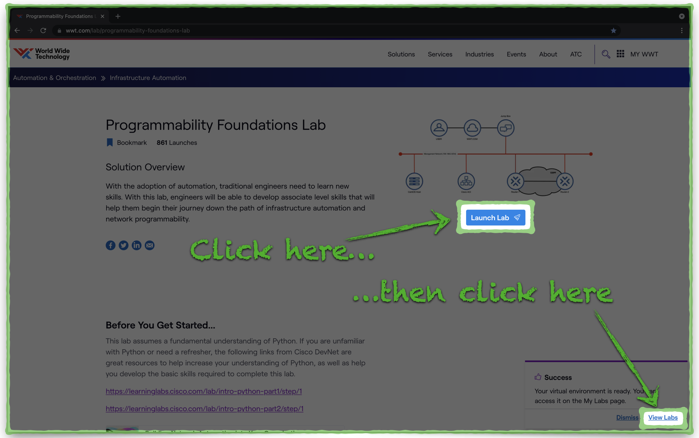](../images/pf_lab/1_launch_lab.png){target=_blank}

            ??? todo "Step 2"

                From the [My Labs](https://www.wwt.com/my-wwt/labs "My WWT Labs"){target=_blank} page, click **Access Lab**:

                [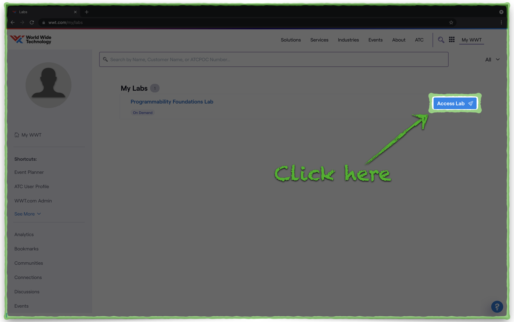](../images/pf_lab/2_access_lab.png){target=_blank}

            ??? todo "Step 3"

                Click the **Open in ATC Lab Gateway button**:

                [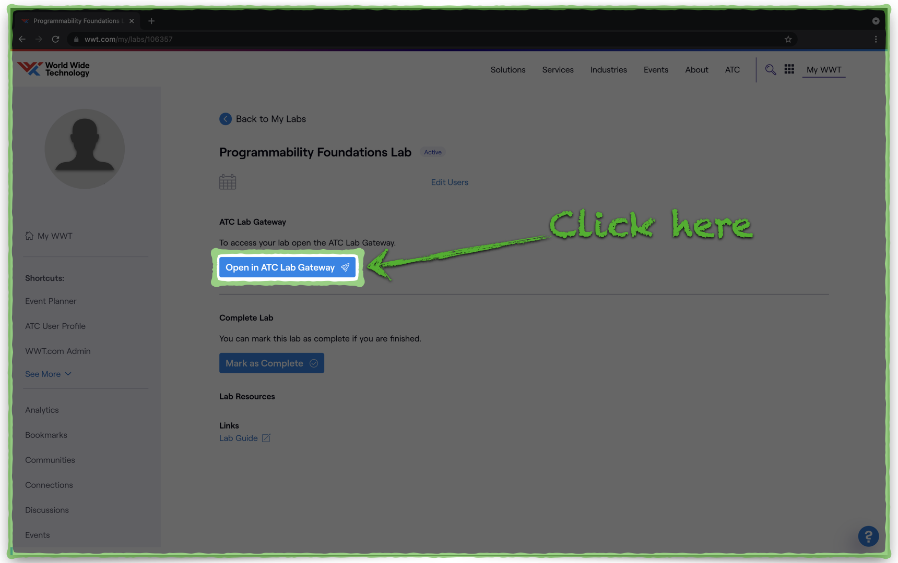](../images/pf_lab/3_open_lab.png){target=_blank}

            ??? todo "Step 4"

                If prompted, log on with your [WWT.com Platform Account Credentials](https://www.wwt.com/login "WWT.com Platform Login"){target=_blank}:

                [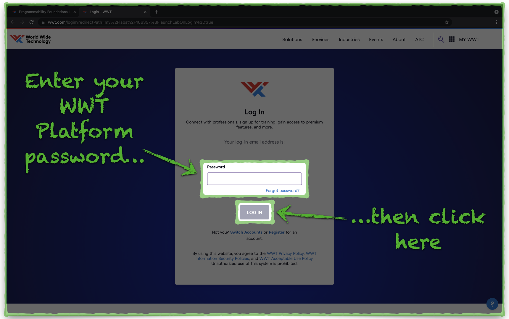](../images/pf_lab/4_lab_authenticate.png){target=_blank}

            ??? todo "Step 5"

                Click the **System Tray icon** and mouse over the **Docker icon** to reveal the service status:

                !!! attention
                    The icon may take a minute or so to appear.

                [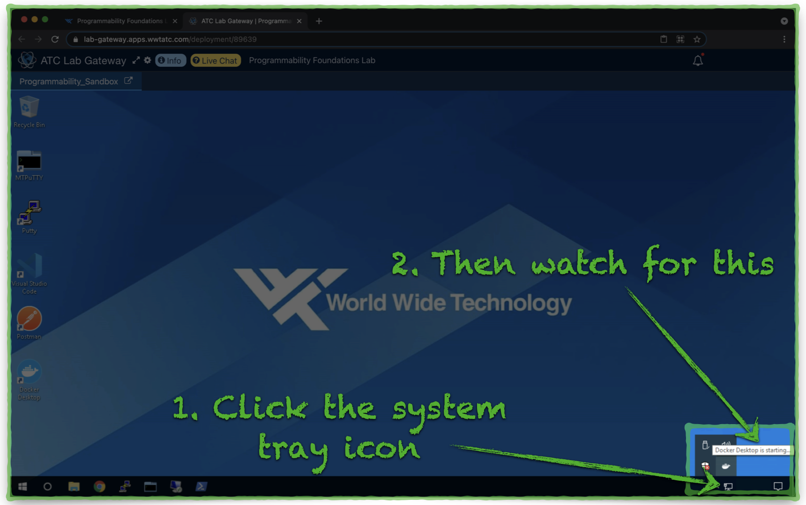](../images/pf_lab/5_wait_for_docker.png){target=_blank}

            ??? todo "Step 6"

                The Docker service is ready when a small exclamation point appears over the **Docker icon**:

                !!! attention
                    It may be a few minutes before the Docker service is ready.

                [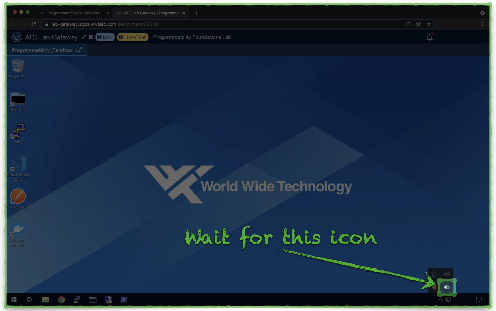](../images/pf_lab/6_docker_startup_complete.png){target=_blank}

                ???+ danger "Important"
                    Occasionally, the Docker Desktop service does not start on its own. Windows may ask you if you want to start the Docker service and thereafter request permission for Net Command​ to run. You may safely confirm both actions.

                    [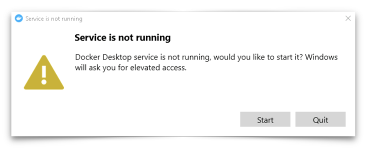](../images/pf_lab/14_start_docker.png){target=_blank}

                    [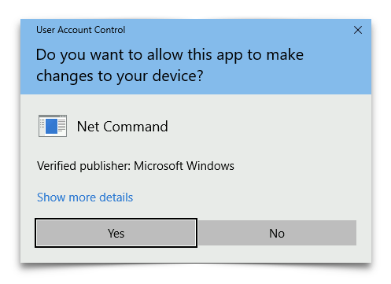](../images/pf_lab/15_start_docker_uac.png){target=_blank}

            ??? todo "Step 7"

                A PowerShell script will customize the lab environment automatically although and you need to paste a long command into a PowerShell window in order to start that process:

                !!! tip
                    1. Click the PowerShell icon in the task bar to open a new PowerShell window.
                    2. Then, copy the entire command below to your clipboard.
                    3. Right-click in the PowerShell window to paste the command
                    4. Press your Return/Enter key to run the command.

                    ```powershell
                    Set-Executionpolicy -Scope CurrentUser -ExecutionPolicy UnRestricted -Force; Set-Location \Users\admin; Invoke-WebRequest -Uri 'https://devasc-data-formats.s3-us-west-2.amazonaws.com/setup_lab.ps1' -OutFile 'setup_lab.ps1’; .\setup_lab.ps1
                    ```
    
                    [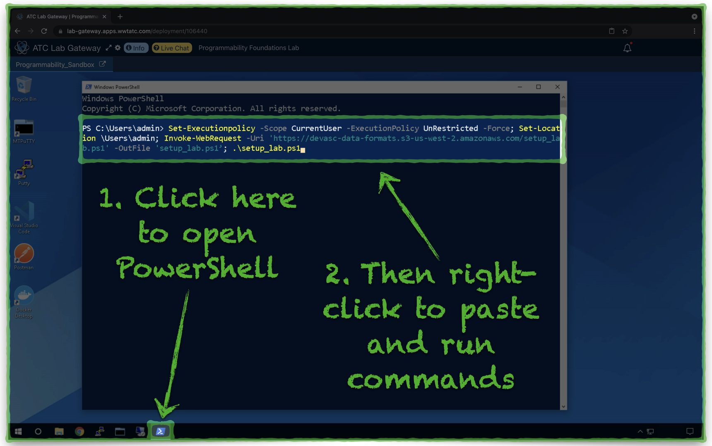](../images/pf_lab/7_paste_ps_commands.png){target=_blank}

                ??? error "What to do if you see a **Docker Desktop process is not running** error message:"

                    - From time-to-time, Windows takes a lenghty amount of time to successfully start the Docker Desktop process and rarely, Windows will fail to start Docker Desktop. If Windows cannot start Docker Desktop, your first indication will be an error message when you run the PowerShell script which configures the lab.

                        [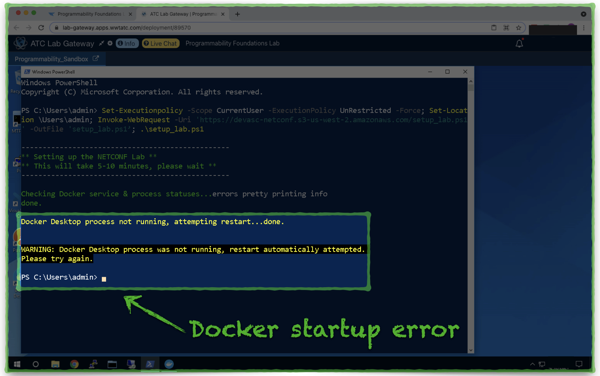](../images/pf_lab/16_start_docker_error.png){target=_blank}
    
                        ---

                    - As the error message indicates, PowerShell will attempt to start or restart the Docker Desktop process. After a few seconds, the Docker Desktop application will open behind the PowerShell and you may bring it to the foreground to monitor the status.

                    ???+ attention "Docker for Windows Process Status"

                        - ==A teal-colored icon== in the lower-left corner of the Docker Desktop application indicates the Docker process is running and you should be able to re-run the PowerShell script to configure the lab environment. Sometimes, Windows takes 5-10 minutes to start the Docker process.

                        - ==An orange-colored icon== in the lower-left corner of the Docker Desktop application indicates the Docker process is not running and you have a couple of options:

                            1. Wait for around 10 minutes, to see if Windows is able to start the Docker process.
                            2. Launch a new instance of the [WWT Programmability Foundations On-Demand Lab](https://www.wwt.com/lab/programmability-foundations-lab "WWT Programmability Foundations On-Demand Lab"){target=_blank}.

                        [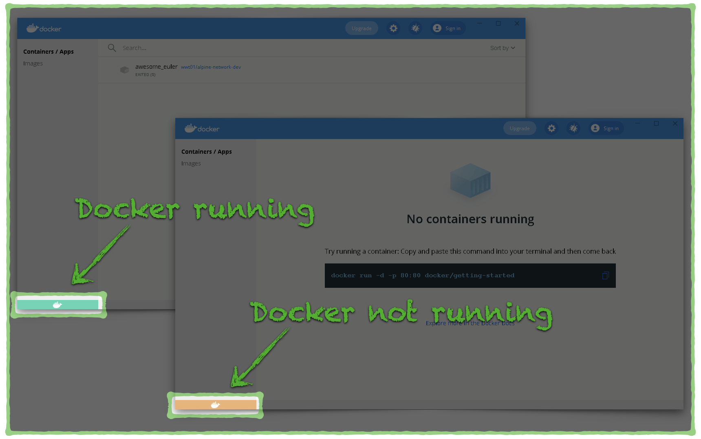](../images/pf_lab/17_docker_status.png){target=_blank}
    
            ??? todo "Step 8"

                 Wait a few minutes for the automated lab setup to complete:

                [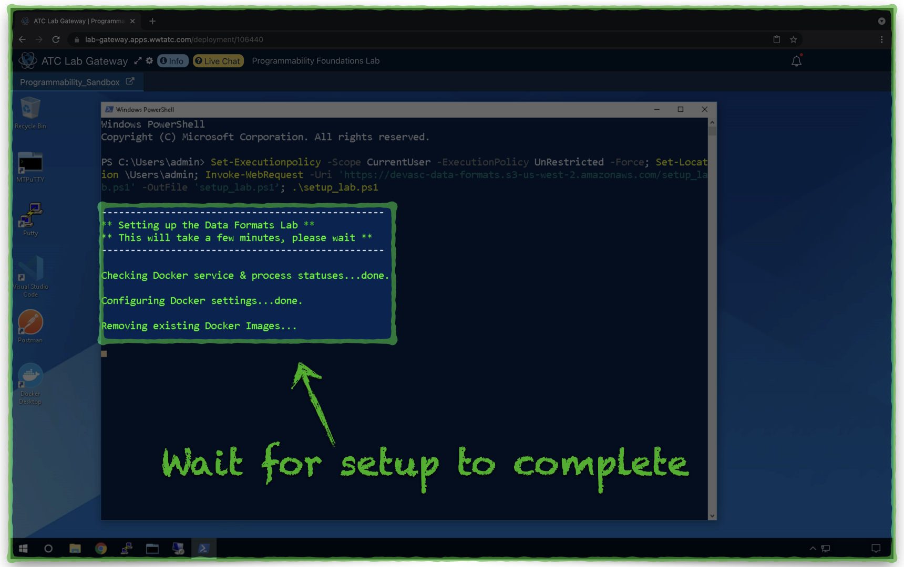](../images/pf_lab/8_jupyter_setup.png){target=_blank}

            ??? todo "Step 9"

                 Within a few minutes, when the lab is ready to use, a Chrome browser will open a **JupyterLab URL**.  Open the **devasc-data-formats** folder from the navigation pane:

                [](../images/pf_lab/9_jupyter_nav_1.png){target=_blank}

            ??? todo "Step 10"

                Next, open the **lab** folder:

                [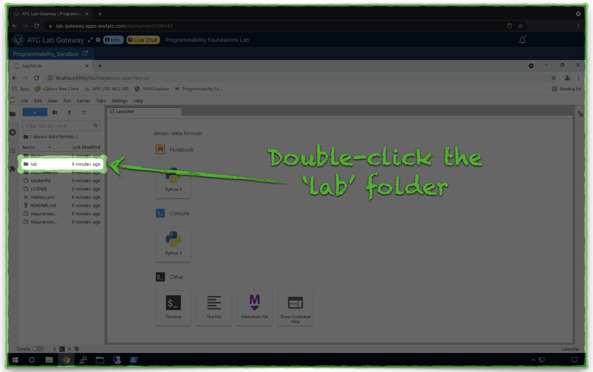](../images/pf_lab/10_jupyter_nav_2.png){target=_blank}

            ??? todo "Step 11"

                Open the **part_i_python** folder:

                [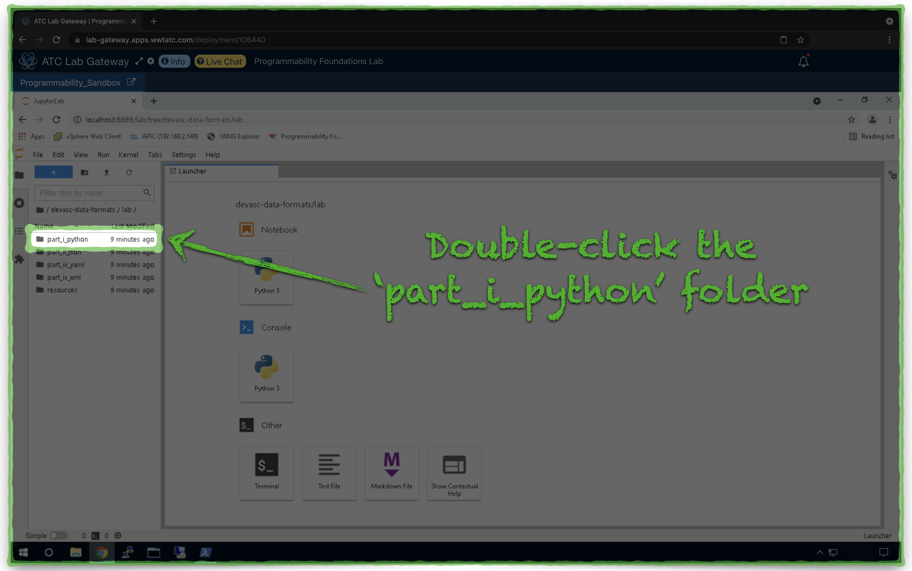](../images/pf_lab/11_jupyter_nav_3.png){target=_blank}

            ??? todo "Step 12"

                 Open the file **python.ipynb** and begin working through the step-by-step instructions in the main pane:

                [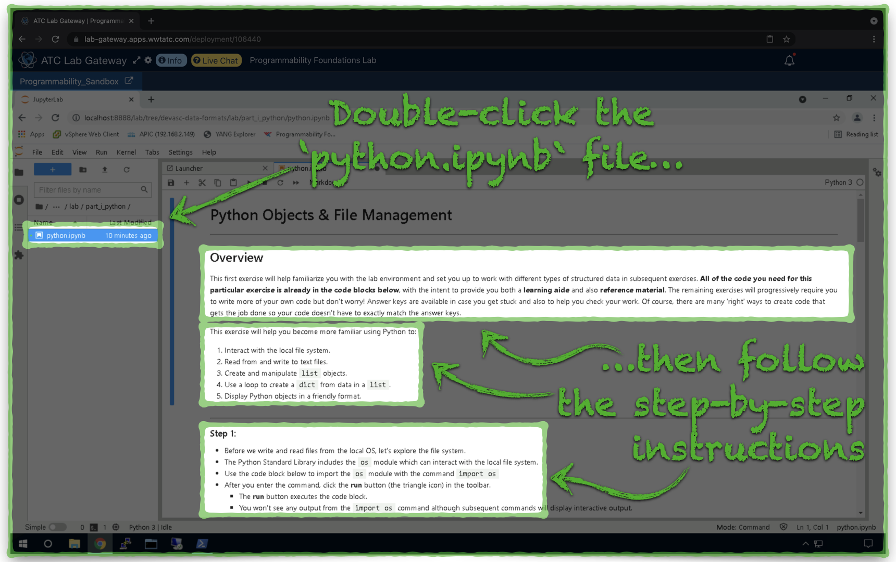](../images/pf_lab/12_jupyter_nav_4.png){target=_blank}

            ??? help "Lab Restart Instructions"

                The lab setup process creates a shotcut on the Windows desktop which will help you restore the lab environment, in the event the JupyterLab browser tab closes, Windows restarts, etc.

                !!! attention "Notice"

                    - The **Restart Lab** shortcut re-launches JupyterLab (including the Chrome browser tab) and will only take a few seconds to complete.
                    - Double-clicking this shortcut will **NOT** cause you to lose any of your lab progress.

                [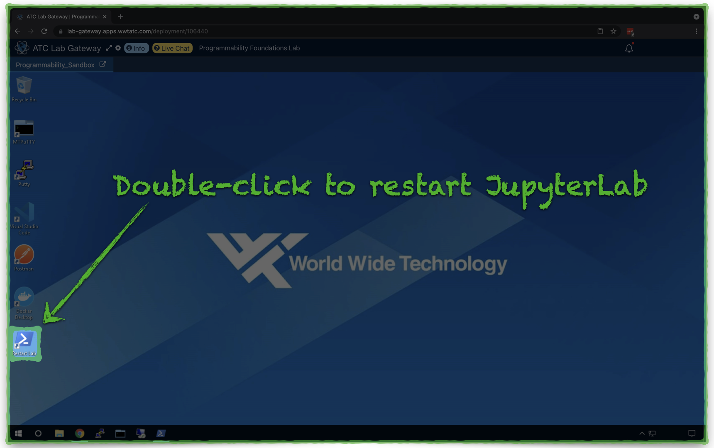](../images/pf_lab/13_lab_restart.png){target=_blank}

    === "Option #2"

        ???+ example "Run a pre-built Container in your own Docker runtime environment"

            !!! attention

                - This option assumes you have an operational Docker runtime environment and that your Docker daemon can connect to and download images from [Docker Hub](https://hub.docker.com/repository/docker/wwt01/devasc-data-formats "Lab Image on Docker Hub){target=_blank}.
                - The screenshots in the directions represent an example from a **macOS Terminal** and the same commands and procedures also work with **Windows PowerShell**.

            ???+ todo "Step 1"

                1. Copy the following command to your clipboard.
                2. Open a terminal shell on the same system as your Docker runtime environment.
                3. Paste the command into your terminal shell.
                4. Run the command.

                ```bash
                docker run -itp 8888:8888 --name data-formats wwt01/devasc-data-formats
                ```

                ??? help "Docker Command Details"

                    The Docker Command performs the following actions:

                    1. Downloas the **wwt01/devasc-data-formats** Docker Image from [Docker Hub](https://hub.docker.com/repository/docker/wwt01/devasc-data-formats "Lab Image on Docker Hub){target=_blank}.
                    2. Creates a new Docker Container with the name **data-formats**
                    3. Attaches to the Container shell.
                    4. Starts a **JupyterLab** server in the Container on **TCP port 8888**.
                    5. Forwards incoming connections to your computer on (**localhost/127.0.0.1)** on **TCP port 8888** to the **JupyterLab** server in the Container.

                [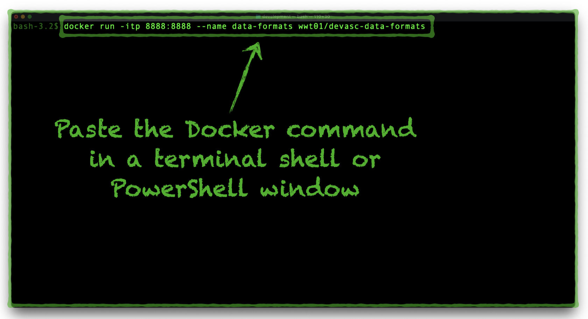](../images/docker_hub/1_docker_run.png){target=_blank}


            ??? todo "Step 2"

                Look for the following output to confirm the **JupyterLab** server is online and ready for incoming connections:

                [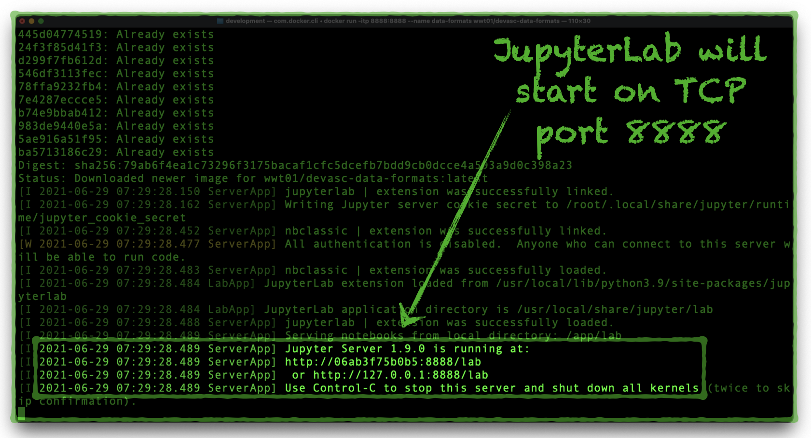](../images/docker_hub/2_jupyter_started.png){target=_blank}

            ??? todo "Step 3"

                1. Open a web browser on your Docker runtime host.
                2. Navigate to the Container's **JupyterLab server** at [http://localhost:8888](http://localhost:8888 "JupyterLab Server"){target=_blank}.
                3. Double-click on the **part_i_python** folder in the navigation pane.

                [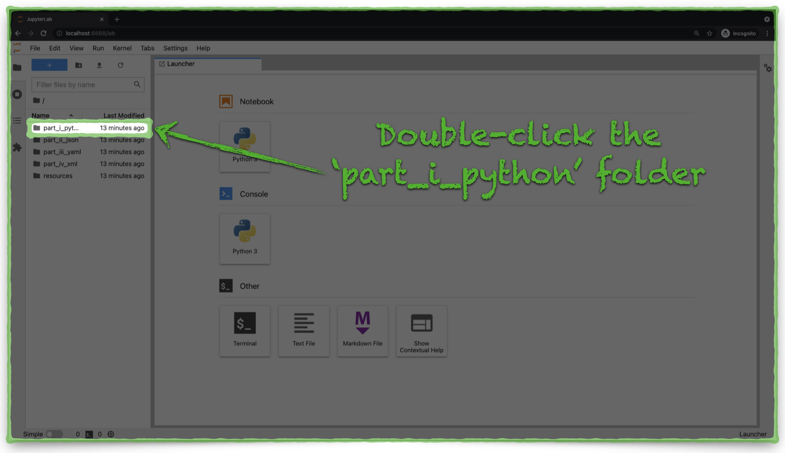](../images/docker_hub/3_open_python_folder.png){target=_blank}

            ??? todo "Step 4"

                Open the file **python.ipynb** and begin working through the step-by-step instructions in the main pane:

                [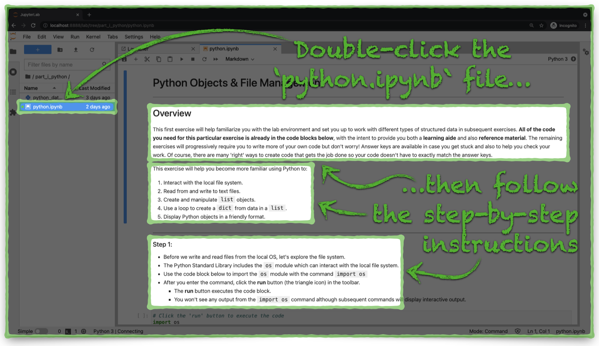](../images/docker_hub/4_open_python_notebook.png){target=_blank}

            ??? help "Lab Environment Shutdown and Restart"

                - To shutdown the lab environment, return to your terminal window and press ++ctrl+c++ twice, **within 5 seconds**.

                [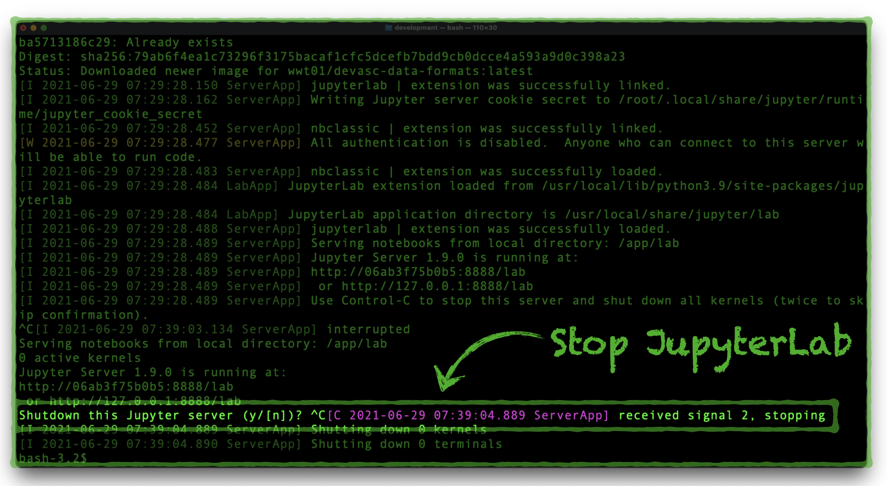](../images/docker_hub/5_stop_jupyter.png){target=_blank}

            ??? note "Lab Environment Docker Command Reference"

                Use the following commands to manage your Docker lab environment:

                - Restart an existing lab environment Container (restores previous lab progress):

                ```bash
                docker start data-formats
                ```

                - Delete an existing lab environment Container (removes previous lab progress):

                ```bash
                docker stop data-formats
                docker rm data-formats
                ```

                - Remove the Docker Image:

                ```bash
                docker stop data-formats
                docker rm data-formats
                docker rmi wwt01/devasc-data-formats
                ```

    === "Option #3"

        ???+ example "Use the Included Visual Studio Code Development Container"

            !!! attention

                This option assumes your computer/development environment has the following software installed and in a functional state:

                1. [Visual Studio Code](https://code.visualstudio.com/Download "Visual Studio Code Download"){target=_blank}.
                2. [Git version control](https://git-scm.com/downloads "Git Installer Download){target=_blank}.
                3. A Docker runtime environment such as [Docker Desktop for Windows or macOS](https://www.docker.com/products/docker-desktop "Docker Desktop for Windows or macOS"){target=_blank}, [Docker for Linux](https://hub.docker.com/search?offering=community&operating_system=linux&q=&type=edition "Docker for Linux"){target=_blank}, etc..
 
                The screenshots in the directions represent an example from a **Microsoft Windows** computer and the same procedures also work with **macOS** and **Linux**.

            ???+ todo "Step 1"

                Clone the Git repository:

                ```bash
                git clone https://github.com/wwt/devasc-data-formats.git
                ```

                // Insert image

            ??? todo "Step 2"

                Open Visual Studio Code:

                // Insert image

            ??? todo "Step 3"

                Install the Remote Development 

                // Insert image

            ??? todo "Step 3"

                Initiate the Development Container Startup Process:

                // Insert image

            ??? todo "Step 3"

                Choose the Path to the cloned Git Repository:

                // Insert image

            ??? todo "Step 4"

                1. Open a web browser on your Docker runtime host.
                2. Navigate to the Container's **JupyterLab server** at [http://localhost:8888](http://localhost:8888 "JupyterLab Server"){target=_blank}.
                3. Double-click on the **part_i_python** folder in the navigation pane.

                // Insert image

            ??? todo "Step 5"

                Open the file **python.ipynb** and begin working through the step-by-step instructions in the main pane:

                // Insert image

            ??? help "Lab Environment Shutdown"

                Close the Development Environment Container

                // Insert image
