# Getting Started With The Lab

## :fontawesome-solid-flask: Lab Overview

The lab environment runs in a Docker Container which hosts a web-based, interactive Python environment called [JupyterLab](https://jupyterlab.readthedocs.io/en/stable/getting_started/overview.html "JupyterLab Overview & User Guide"){target=_blank}.  The JupyterLab server will allow you to work through a series of Python-based, **data encoding formats** exercises using your web browser.

---

### :fontawesome-brands-docker: Lab Requirements

You only need a few things to start working through the labs:

1. A Docker runtime environment.

    - [Docker Desktop for Windows or macOS](https://www.docker.com/products/docker-desktop "Docker Desktop for Windows or macOS"){target=_blank}, [Docker for Linux](https://hub.docker.com/search?offering=community&operating_system=linux&q=&type=edition "Docker for Linux"){target=_blank}, etc.

2. A web browser with [JupyterLab support](https://jupyterlab.readthedocs.io/en/stable/getting_started/installation.html#supported-browsers "JupyterLab Supported Browsers"){target=_blank}.

---

## :material-beaker: Lab Setup Instructions

We provide instructions for three different lab setup options.  Choose the option that best suits your needs and then follow the step-by-step directions:

???+ abstract "Lab Setup Options"

    1. :fontawesome-solid-laptop-code: **Auto-provision the environment in the [WWT Programmability Foundations On-Demand Lab](https://www.wwt.com/lab/programmability-foundations-lab "WWT Programmability Foundations On-Demand Lab"){target=_blank}.**
        - The best chioce if you don't have a place to install and run Docker or if you need an on-demand learning and test environment.

    2. :fontawesome-brands-docker: **Run a pre-built Container in your own Docker runtime environment.**
        - The best choice if you want the quickest lab setup experience and ideal if you already have Docker running in your development environment.

    3. :material-microsoft-visual-studio-code: **Use the Visual Studio Code Development Container in the [Git Repository](https://github.com/wwt/devasc-data-formats "DEVASC Data Formats Git Repository"){target=_blank}.**
        - The best choice if you want an easy environment to both run the lab and also to access or modify source files.

    === "Option #1"

        ???+ example "Auto-provision the environment in the WWT Programmability Foundations Lab"

            ???+ todo "Step 1"

                Launch a new copy of the [WWT Programmability Foundations On-Demand Lab](https://www.wwt.com/lab/programmability-foundations-lab "WWT Programmability Foundations On-Demand Lab"){target=_blank} and click [View Labs](https://www.wwt.com/my/labs "My WWT Labs"){target=_blank}:

                [](../images/pf_lab/1_launch_lab.png){target=_blank}

            ??? todo "Step 2"

                From the [My Labs](https://www.wwt.com/my-wwt/labs "My WWT Labs"){target=_blank} page, click **Access Lab**:

                [](../images/pf_lab/2_access_lab.png){target=_blank}

            ??? todo "Step 3"

                Click the **Open in ATC Lab Gateway button**:

                [](../images/pf_lab/3_open_lab.png){target=_blank}

            ??? todo "Step 4"

                If prompted, log on with your [WWT.com Platform Account Credentials](https://www.wwt.com/login "WWT.com Platform Login"){target=_blank}:

                [](../images/pf_lab/4_lab_authenticate.png){target=_blank}

            ??? todo "Step 5"

                Click the **System Tray icon** and mouse over the **Docker icon** to reveal the service status:

                !!! attention
                    The icon may take a minute or so to appear.

                [](../images/pf_lab/5_wait_for_docker.png){target=_blank}

            ??? todo "Step 6"

                The Docker service is ready when a small exclamation point appears over the **Docker icon**:

                !!! attention
                    It may be a few minutes before the Docker service is ready.

                [](../images/pf_lab/6_docker_startup_complete.png){target=_blank}

                ???+ danger "Important"
                    Occasionally, the Docker Desktop service does not start on its own. Windows may ask you if you want to start the Docker service and then request permission for Net Command​ to run. You may safely confirm both actions.

                    [](../images/pf_lab/14_start_docker.png){target=_blank}

                    [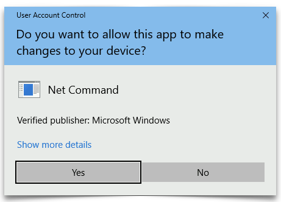](../images/pf_lab/15_start_docker_uac.png){target=_blank}

            ??? todo "Step 7"

                A PowerShell script will customize the lab environment automatically although and you need to paste a long command into a PowerShell window to start that process:

                !!! tip
                    1. Click the PowerShell icon in the taskbar to open a new PowerShell window.
                    2. Then, copy the entire command below to your clipboard.
                    3. Right-click in the PowerShell window to paste the command
                    4. Press your ++enter++ or ++"Return"++ key to run the command.

                    ```powershell
                    Set-Executionpolicy -Scope CurrentUser -ExecutionPolicy UnRestricted -Force; Set-Location \Users\admin; Invoke-WebRequest -Uri 'https://devasc-data-formats.s3-us-west-2.amazonaws.com/setup_lab.ps1' -OutFile 'setup_lab.ps1’; .\setup_lab.ps1
                    ```
    
                    [](../images/pf_lab/7_paste_ps_commands.png){target=_blank}

                ??? error "What to do if you see a 'Docker Desktop process is not running' error message:"

                    - From time to time, the Windows desktop in this lab takes a lengthy amount of time to successfully start the Docker Desktop process and, rarely, Windows will fail to start Docker Desktop. If Windows cannot start Docker Desktop, your first indication will be an error message when you run the PowerShell script that configures the lab.

                        [](../images/pf_lab/16_start_docker_error.png){target=_blank}
    
                        ---

                    ???+ attention "Docker for Windows Process Status"

                        - As the PowerShell error message indicates, PowerShell will attempt to start or restart the Docker Desktop process. After a few seconds, the Docker Desktop application will open behind the PowerShell window, and you may bring it to the foreground to monitor the status.
                        
                        - ==A teal-colored icon== in the lower-left corner of the Docker Desktop application indicates the Docker process is running and you should be able to re-run the PowerShell script to configure the lab environment. Sometimes, Windows takes 5-10 minutes to start the Docker process.

                        - ==An orange-colored icon== in the lower-left corner of the Docker Desktop application indicates the Docker process is not running and you have a couple of options:

                            1. Wait for around 10 minutes to see if Windows can start the Docker process.
                            2. Launch a new instance of the [WWT Programmability Foundations On-Demand Lab](https://www.wwt.com/lab/programmability-foundations-lab "WWT Programmability Foundations On-Demand Lab"){target=_blank}.

                        [](../images/pf_lab/17_docker_status.png){target=_blank}
    
            ??? todo "Step 8"

                 Wait a few minutes for the automated lab setup to complete:

                [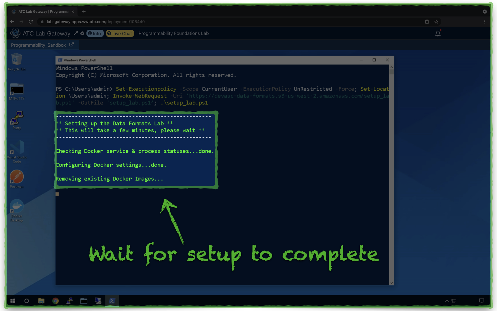](../images/pf_lab/8_jupyter_setup.png){target=_blank}

            ??? todo "Step 9"

                 Within a few minutes, when the lab is ready to use, a Chrome browser will open a **JupyterLab URL**.  Open the **devasc-data-formats** folder from the navigation pane:

                [](../images/pf_lab/9_jupyter_nav_1.png){target=_blank}

            ??? todo "Step 10"

                Next, open the **lab** folder:

                [](../images/pf_lab/10_jupyter_nav_2.png){target=_blank}

            ??? todo "Step 11"

                Open the **part_i_python** folder:

                [](../images/pf_lab/11_jupyter_nav_3.png){target=_blank}

            ??? todo "Step 12"

                 Open the file **python.ipynb** and follow the step-by-step instructions in the main pane:

                [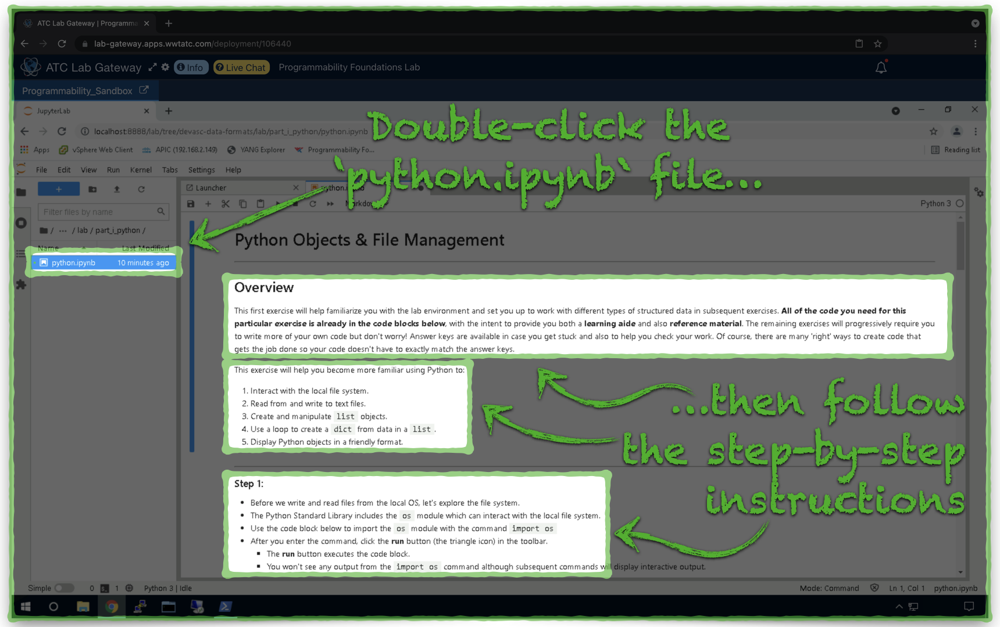](../images/pf_lab/12_jupyter_nav_4.png){target=_blank}

            ??? help "Lab Restart Instructions"

                The lab setup process creates a shortcut on the Windows desktop, which will help you restore the lab environment in the event the JupyterLab browser tab closes, Windows restarts, etc.

                !!! attention "Notice"

                    - The **Restart Lab** shortcut re-launches JupyterLab (including the Chrome browser tab) and will only take a few seconds to complete.
                    - Double-clicking this shortcut will **NOT** cause you to lose any of your lab progress.

                [](../images/pf_lab/13_lab_restart.png){target=_blank}

    === "Option #2"

        ???+ example "Run a pre-built Container in your own Docker runtime environment"

            !!! attention

                - This option assumes you have an operational Docker runtime environment and that your Docker daemon can connect to and download images from [Docker Hub](https://hub.docker.com/repository/docker/wwt01/devasc-data-formats "Lab Image on Docker Hub){target=_blank}.
                - The screenshots in the directions represent an example from a **macOS Terminal**, and the same commands and procedures also work with **Windows PowerShell**.

            ???+ todo "Step 1"

                1. Copy the following command to your clipboard.
                2. Open a terminal shell on the same system as your Docker runtime environment.
                3. Paste the command into your terminal shell.
                4. Run the command.

                ```bash
                docker run -itp 8888:8888 --name data-formats wwt01/devasc-data-formats
                ```

                ??? help "Docker Command Details"

                    The Docker Command performs the following actions:

                    1. Downloas the **wwt01/devasc-data-formats** Docker Image from [Docker Hub](https://hub.docker.com/repository/docker/wwt01/devasc-data-formats "Lab Image on Docker Hub){target=_blank}.
                    2. Creates a new Docker Container with the name **data-formats**
                    3. Attaches to the Container shell.
                    4. Starts a **JupyterLab** server in the Container on **TCP port 8888**.
                    5. Forwards incoming connections to your computer on (**localhost/127.0.0.1)** on **TCP port 8888** to the **JupyterLab** server in the Container.

                [](../images/docker_hub/1_docker_run.png){target=_blank}


            ??? todo "Step 2"

                Look for the following output to confirm the **JupyterLab** server is online and ready for incoming connections:

                [](../images/docker_hub/2_jupyter_started.png){target=_blank}

            ??? todo "Step 3"

                1. Open a web browser on your Docker runtime host.
                2. Navigate to the Container's **JupyterLab server** at [http://localhost:8888](http://localhost:8888 "JupyterLab Server"){target=_blank}.
                3. Double-click on the **part_i_python** folder in the navigation pane.

                [](../images/docker_hub/3_open_python_folder.png){target=_blank}

            ??? todo "Step 4"

                Open the file **python.ipynb** and begin working through the step-by-step instructions in the main pane:

                [](../images/docker_hub/4_open_python_notebook.png){target=_blank}

            ??? help "Lab Environment Shutdown and Restart"

                - To shut down the lab environment, return to your terminal window and press ++ctrl+c++ twice, **within 5 seconds**.

                [](../images/docker_hub/5_stop_jupyter.png){target=_blank}

            ??? note "Lab Environment Docker Command Reference"

                Use the following commands to manage your Docker lab environment:

                - Restart an existing lab environment Container (restores previous lab progress):

                ```bash
                docker start data-formats
                ```

                - Delete an existing lab environment Container (removes previous lab progress):

                ```bash
                docker stop data-formats
                docker rm data-formats
                ```

                - Remove the Docker Image:

                ```bash
                docker stop data-formats
                docker rm data-formats
                docker rmi wwt01/devasc-data-formats
                ```

    === "Option #3"

        ???+ example "Use the Visual Studio Code Development Container in the Git Repository"

            !!! attention

                This option assumes your computer/development environment has the following software installed and in a functional state:

                1. [Visual Studio Code](https://code.visualstudio.com/Download "Visual Studio Code Download"){target=_blank} ==**version 1.5 or later**==.

                2. [Git version control](https://git-scm.com/downloads "Git Installer Download){target=_blank}.

                3. A Docker runtime environment such as [Docker Desktop for Windows or macOS](https://www.docker.com/products/docker-desktop "Docker Desktop for Windows or macOS"){target=_blank}, [Docker for Linux](https://hub.docker.com/search?offering=community&operating_system=linux&q=&type=edition "Docker for Linux"){target=_blank}, etc..

 
                The screenshots in the directions represent an example from a **macOS** computer, and the same procedures also work with **Microsoft Windows** and **Linux** computers.

            ???+ todo "Step 1"

                Clone the [Git Repository](https://github.com/wwt/devasc-data-formats "DEVASC Data Formats Git Repository"){target=_blank} to your development computer with the following command:

                ```bash
                git clone https://github.com/wwt/devasc-data-formats.git
                ```

                [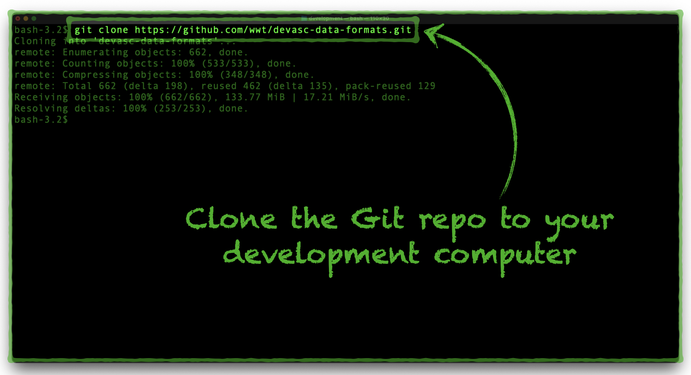](../images/dev_container/1_clone_repo.png){target=_blank}

            ??? todo "Step 2"

                Install the [Visual Studio Code Remote Development Extension Pack](https://marketplace.visualstudio.com/items?itemName=ms-vscode-remote.vscode-remote-extensionpack "Visual Studio Code Remote Development Extension Pack"){target=_blank}:

                1. Open Visual Studio Code.
                2. Click the **Extensions** icon.
                3. Copy the **Remote Development Pack Extension ID string** to your clipboard:

                    ```text
                    ms-vscode-remote.vscode-remote-extensionpack
                    ```

                4. Paste the **Remote Development Pack Extension ID string** in the search box.
                5. Click one of the **Install** buttons.

                [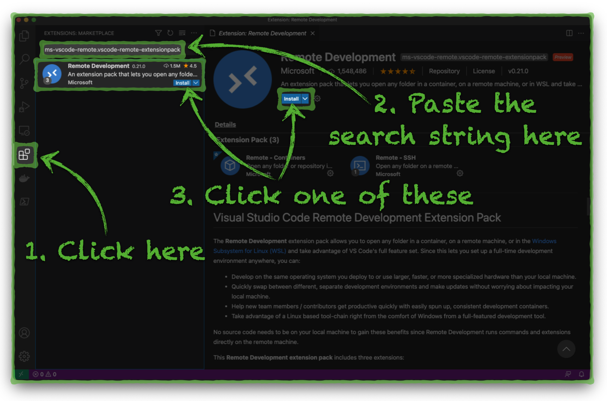](../images/dev_container/2_install_remote_dev_extension.png){target=_blank}

            ??? todo "Step 3"

                Open the Git Repository in a Development Container:

                1. Click the **Remote Development** icon in the lower-left corner of the VS Code window.
                2. From the drop menu, choose the option to **Open Folder in Container**.

                [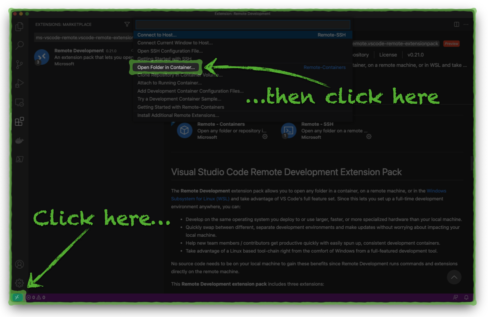](../images/dev_container/3_open_remote_dev_container.png){target=_blank}

            ??? todo "Step 4"

                Locate and select the Git repository folder on your development computer:

                [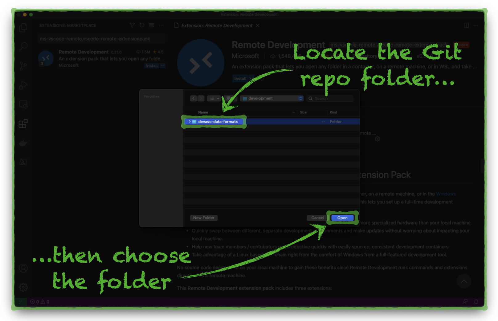](../images/dev_container/4_choose_git_repo.png){target=_blank}

            ??? todo "Step 5"

                Monitor the Development Environment build process:

                1. Click the **show log** link in the lower-right corner of the VS Code window.
                2. Observe the console output as the Container builds and starts.

                !!! attention "Notice"

                    - The initial build process may take 5-10 minutes to complete.
                    - Subsequent activations will only take a few seconds.

                [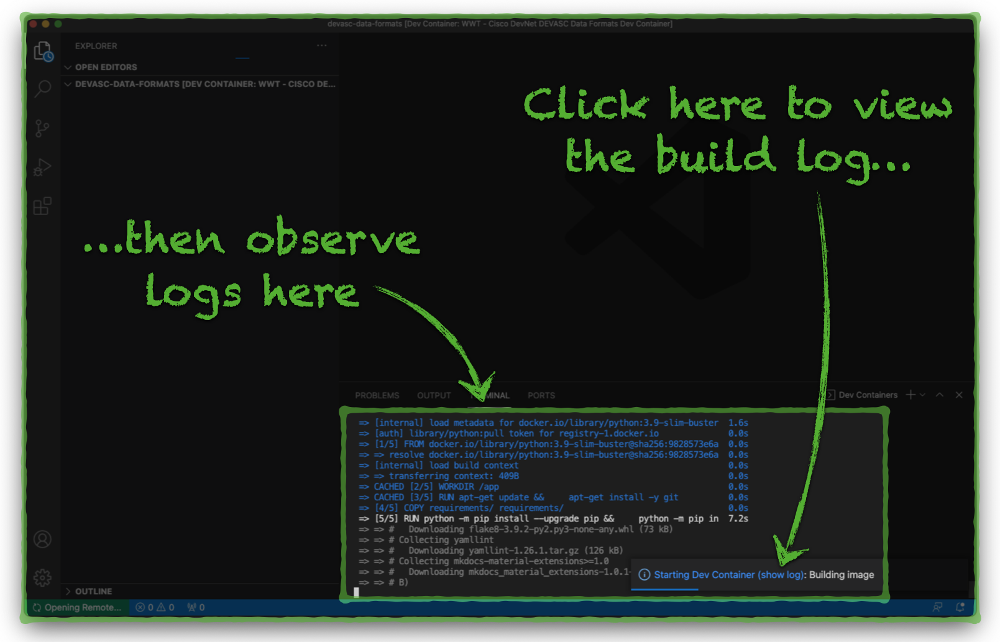](../images/dev_container/5_monitor_dev_container_build.png){target=_blank}

            ??? todo "Step 6"

                Observe the Development Environment complete activation:

                1. The Git **repository file tree** will appear on the left side of the VS Code window.
                2. The **VS Code terminal window** will display **JupyterLab** activation information.

                !!! attention "Notice"

                    You may safely close the **VS Code Terminal Window** or toggle its visibility with the ++ctrl+grave++ key sequence.

                [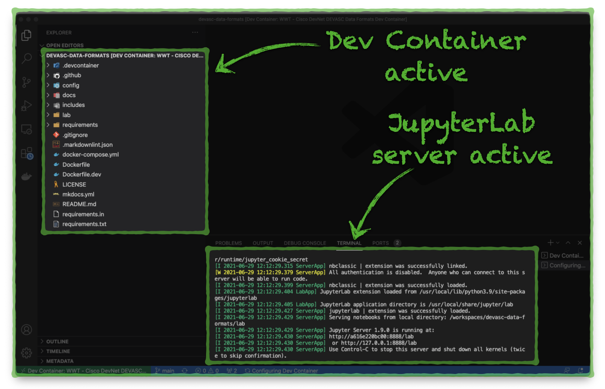](../images/dev_container/6_dev_container_active.png){target=_blank}

            ??? todo "Step 7"

                1. Open a web browser on your development computer.
                2. Navigate to the Development Container's **JupyterLab server** at [http://localhost:8888](http://localhost:8888 "JupyterLab Server"){target=_blank}.
                3. Double-click on the **part_i_python** folder in the navigation pane.

                [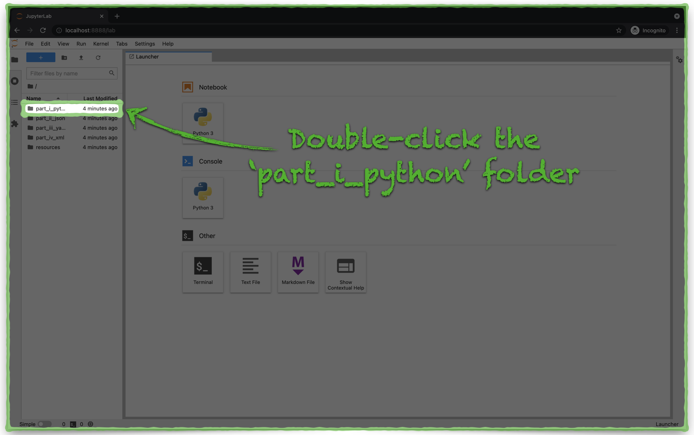](../images/dev_container/7_jupyter_nav_1.png){target=_blank}

            ??? todo "Step 8"

                Open the file **python.ipynb** and follow the step-by-step instructions in the main pane:

                [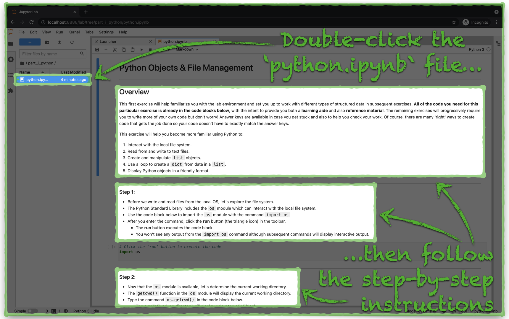](../images/dev_container/8_jupyter_nav_2.png){target=_blank}

            ??? help "Development Environment Shutdown"

                You may close the **Development Environment Container** without losing any of your lab progress from the Visual Studio Code Development Environment window:

                1. Click the **Remote Development** icon in the lower-left corner of the VS Code window.
                2. From the drop menu, choose the option to **Close Remote Connection**.

                [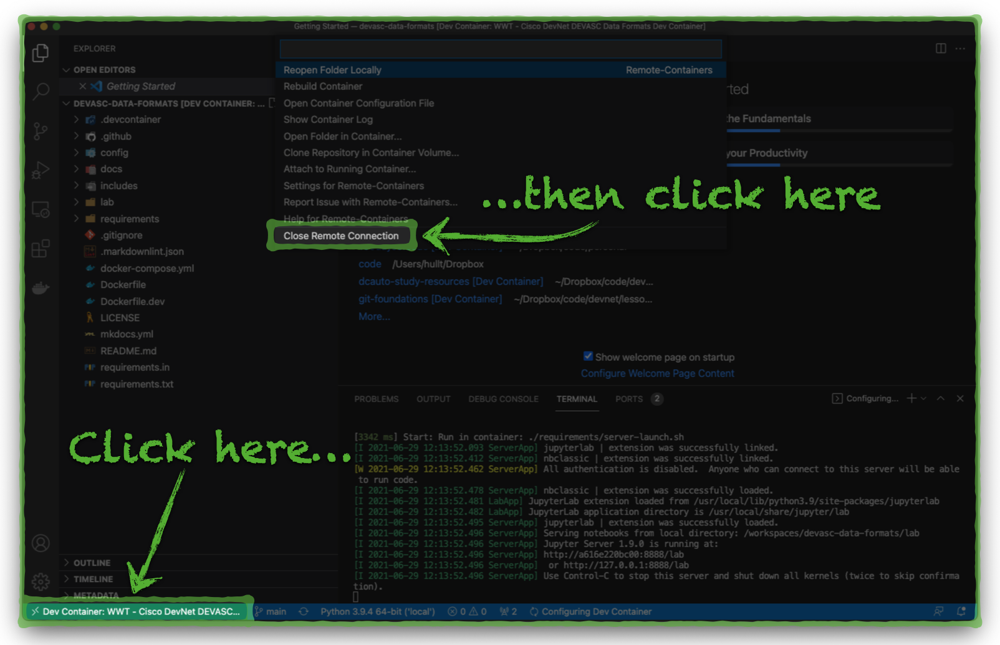](../images/dev_container/9_close_remote_dev_container.png){target=_blank}
